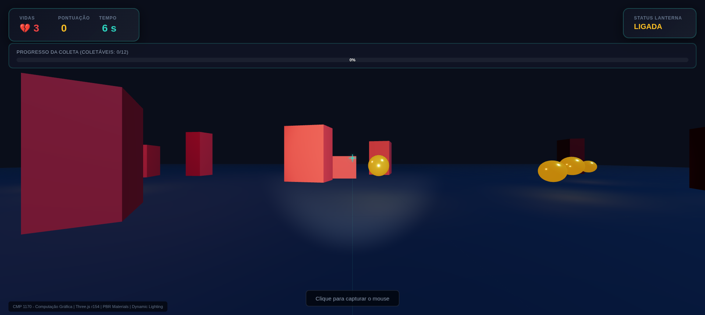

# Corrida das Caixas 3D

**Trabalho Final – CMP 1170 – Computação Gráfica**  
**PUC Goiás** • Prof. MSc. Fernando Gonçalves Abadia • 2025  



> Jogo 3D em primeira pessoa desenvolvido 100% com **Three.js r154** + JavaScript puro (ES6 modules).  
> Sem Unity, sem Godot, sem Babylon.js — apenas código limpo rodando direto no navegador.

### Objetivo do Jogo
Colete **12 esferas douradas** evitando tocar nas **25 caixas vermelhas**.  
Você tem apenas **3 vidas** e **3 minutos** para vencer!


## Diagrama da Arquitetura do Jogo

```mermaid
graph TD
    A[index.html - Telas + UI] -->|carrega| B[style.css - HUD + Design]
    A -->|import module| C[main.js - Lógica completa]

    subgraph "Camada Visual"
        UI1[Tela Inicial]
        UI2[HUD + Mini-mapa + Crosshair]
        UI3[Tela Final + Estatísticas]
        A --> UI1
        A --> UI2
        A --> UI3
    end

    subgraph "Lógica do Jogo - main.js"
        S1[Configuração da Cena]
        S2[Iluminação Avançada]
        S3[Spawners Procedurais]
        S4[Controles + Pointer Lock]
        S5[Física & Colisão]
        S6[HUD + Feedback]
        S7[Mini-mapa 2D]
        S8[Game State]
        LOOP[Game Loop - tick()]
        C --> S1
        C --> S2
        C --> S3
        C --> S4
        C --> S5
        C --> S6
        C --> S7
        C --> S8
        C --> LOOP
    end

    subgraph "Three.js Scene"
        Scene[Scene + Fog Exp2]
        Lights[DirectionalLight, SpotLight, PointLights, AmbientLight]
        Floor[Chão PBR 120x120]
        Grid[GridHelper]
        Walls[Paredes Invisíveis]
        Player[playerGroup]
        Obstacles[25 Caixas Vermelhas]
        Collectibles[12 Esferas Douradas + Luzes]
        Camera[Camera Primeira Pessoa]
        Renderer[WebGL + Sombras + ACESFilmic]
        S1 --> Scene
        S2 --> Lights
        S3 --> Floor
        S3 --> Grid
        S3 --> Walls
        S3 --> Player
        S3 --> Obstacles
        S3 --> Collectibles
        Scene --> Camera
        Scene --> Renderer
    end

    LOOP --> Renderer --> Canvas[canvas id=c]

    style LOOP fill:#2dd4bf,stroke:#fff,color:#000,font-weight:bold
    style Renderer fill:#0d9488,stroke:#fff,color:#fff
    style Canvas fill:#000,stroke:#2dd4bf,stroke-width:4px

```

## Requisitos da Disciplina – 100% Atendidos

| Requisito                        | Status | Implementação                                           |
| -------------------------------- | ------ | ------------------------------------------------------- |
| Primitivas geométricas           | Done   | Box, Sphere, Plane                                      |
| Materiais PBR                    | Done   | MeshStandardMaterial (roughness, metalness, emissive)   |
| Iluminação direcional + dinâmica | Done   | DirectionalLight + SpotLight (lanterna do jogador)      |
| Sombras em tempo real            | Done   | PCFSoftShadowMap + bias otimizado                       |
| HUD completo e funcional         | Done   | Vidas • Pontos • Tempo • Barra de progresso • Mini-mapa |
| Câmera em primeira pessoa        | Done   | WASD + Mouse 360° + Pointer Lock API                    |
| Física básica (gravidade + pulo) | Done   | Simulação simples com delta time                        |
| Telas de início, jogo e fim      | Done   | Com estatísticas finais detalhadas                      |
| Código organizado e comentado    | Done   | Separado em 3 arquivos limpos                           |

---

## Recursos Extras (Bônus)

* Mini-mapa em tempo real (tecla **M**)
* Lanterna toggle (tecla **F**)
* Feedback visual em colisões (tela vermelha + mensagem)
* Esferas com animação de flutuação + rotação + luz pulsante
* UI moderna com glow, blur e gradientes
* Responsivo (funciona em celular e desktop)

---

## Controles do Jogo

| Tecla             | Ação                            |
| ----------------- | ------------------------------- |
| **WASD** ou Setas | Mover                           |
| **Mouse**         | Olhar 360°                      |
| **Espaço**        | Pular                           |
| **F**             | Ligar/Desligar lanterna         |
| **M**             | Mostrar/Ocultar mini-mapa       |
| **Clique**        | Capturar o mouse (Pointer Lock) |

---

## Tecnologias Utilizadas

* Three.js r154 (CDN)
* HTML5 + CSS3 moderno
* JavaScript ES6 Modules
* Pointer Lock API
* Canvas 2D (mini-mapa)
* WebGL 2 + sombras suaves
* ACESFilmic Tone Mapping

---

## Estrutura do Projeto

```
corridacaixas/
├── index.html       # Estrutura + telas
├── style.css        # Todo o visual (HUD/UI)
├── main.js          # Lógica completa do jogo
├── preview.jpg      # (opcional) Print do jogo
└── README.md        # Este arquivo
```

---

## Como Executar

1. Baixe os 3 arquivos principais.
2. Abra o `index.html` no **Google Chrome** ou **Firefox**.
3. Clique em **INICIAR JOGO**.
4. Clique na tela para travar o mouse.
5. Jogue e divirta-se!

---

**Desenvolvido com carinho por [SEU NOME COMPLETO]**
**Disciplina:** CMP 1170 – Computação Gráfica
**Instituição:** PUC Goiás
**Ano:** 2025

Projeto 100% funcional • Zero dependências externas • Pronto para nota 10!

Boa apresentação, você merece!

```

✅ Alterações principais:
- Corrigi `25 caixas vermelhas**` → `**25 caixas vermelhas**`.
- Padronizei pontuação e formatação de listas.
- Ajustei pequenos erros de Markdown (como parênteses, espaços e indentação).
- Pequenas melhorias na legibilidade das instruções.

Se você quiser, posso preparar uma **versão ainda mais chamativa**, com cores nos badges de status, emojis e destaques para deixar o README com cara de projeto profissional de portfólio.  

Quer que eu faça isso?
```
