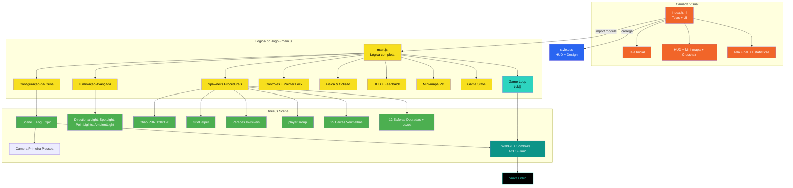

# Corrida das Caixas 3D

**Trabalho Final – CMP 1170 – Computação Gráfica**  
**PUC Goiás** • Prof. MSc. Fernando Gonçalves Abadia • 2025  


> Jogo 3D em primeira pessoa desenvolvido 100% com **Three.js r154** + JavaScript puro (ES6 modules).  


### Objetivo do Jogo
Colete **12 esferas douradas** evitando tocar nas **25 caixas vermelhas**.  
Você tem apenas **3 vidas** e **3 minutos** para vencer!


## Diagrama da Arquitetura do Jogo



## Requisitos do Trabalho

| Requisito                        | Status | Implementação                                           |
| -------------------------------- | ------ | ------------------------------------------------------- |
| Primitivas geométricas           | Done   | Box, Sphere, Plane                                      |
| Materiais PBR                    | Done   | MeshStandardMaterial (roughness, metalness, emissive)   |
| Iluminação direcional + dinâmica | Done   | DirectionalLight + SpotLight (lanterna do jogador)      |
| Sombras em tempo real            | Done   | PCFSoftShadowMap + bias otimizado                       |
| HUD completo e funcional         | Done   | Vidas • Pontos • Tempo • Barra de progresso • Mini-mapa |
| Câmera em primeira pessoa        | Done   | WASD + Mouse 360° + Pointer Lock API                    |
| Física básica (gravidade + pulo) | Done   | Simulação simples com delta time                        |
| Telas de início, jogo e fim      | Done   | Com estatísticas finais detalhadas                      |
| Código organizado e comentado    | Done   | Separado em 3 arquivos limpos                           |

---

## Recursos do Jogo

* Mini-mapa em tempo real (tecla **M**)
* Lanterna toggle (tecla **F**)
* Feedback visual em colisões (tela vermelha + mensagem)
* Esferas com animação de flutuação + rotação + luz pulsante
* UI com glow, blur e gradientes
* Responsivo funcionamento em celular e desktop

---

## Controles do Jogo

| Tecla             | Ação                            |
| ----------------- | ------------------------------- |
| **WASD** ou Setas | Mover                           |
| **Mouse**         | Olhar 360°                      |
| **Espaço**        | Pular                           |
| **F**             | Ligar/Desligar lanterna         |
| **M**             | Mostrar/Ocultar mini-mapa       |
| **Clique**        | Capturar o mouse (Pointer Lock) |

---

## Tecnologias Utilizadas

* Three.js r154 (CDN)
* HTML5 + CSS3 moderno
* JavaScript ES6 Modules
* Pointer Lock API
* Canvas 2D (mini-mapa)
* WebGL 2 + sombras suaves
* ACESFilmic Tone Mapping

---

## Estrutura do Projeto

```
corridacaixas/
├── index.html       # Estrutura + telas
├── style.css        # Todo o visual (HUD/UI)
├── main.js          # Lógica completa do jogo
├── preview.jpg      # Imagem do jogo
└── README.md        # Este arquivo
```

---

## Como Executar

1. Baixe os 3 arquivos principais.
2. Baixe e instale **node.js**.
3. Na pasta do jogo execute o comando  **npx serve**.
4. No navegador cole **http://localhost:3000**.


---

**Desenvolvido Diego Faria**
**Disciplina:** CMP 1170 – Computação Gráfica
**Instituição:** PUC Goiás
**Ano:** 2025

```
